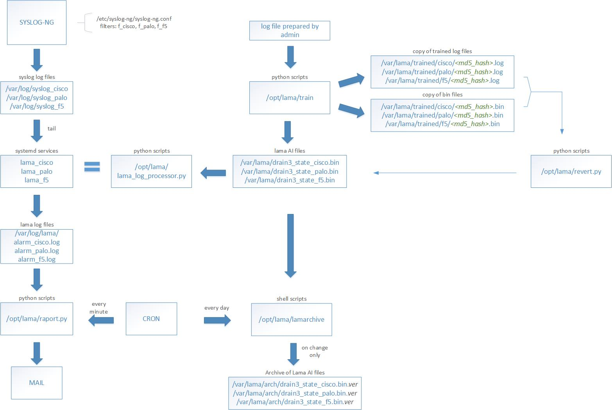

## 1. Funkcjonalność Lama

Lama to narzędzie służące do wykrywania nietypowych zdarzeń z wykorzystaniem metod uczenia maszynowego. Źródłem danych są logi urządzeń, a efektem działania systemu jest alarm w postaci wiadomości e-mail wysyłanej do administratora. Aplikacja jest przeznaczona dla środowisk generujących bardzo dużą liczbę logów, których manualna analiza jest niewykonalna. Rdzeniem systemu jest biblioteka [Drain3], odpowiadająca za operacje związane z uczeniem maszynowym. Zalecane jest zapoznanie się z jej dokumentacją.

> Termin "False Positive"  -  w kontekście tej aplikacji termin ten oznacza alarmy, które nie informują o rzeczywistej awarii. Celem aplikacji jest odfiltrowanie zdarzeń rzeczywiście istotnych.

## 2. Elementy aplikacji

### 2.1. Źródło logów
Danymi wejściowymi są pliki z bieżącymi logami przygotowanymi przez serwer Syslog (np. Syslog-ng, Graylog). Wskazane jest wstępne filtrowanie logów, np. według poziomu istotności (severity), aby analizie poddawane były wyłącznie logi ważne.
 Aplikacja zakłada istnienie oddzielnych plików logów dla każdego producenta urządzeń. Każdy typ urządzeń otrzymuje unikalną etykietę (tag), np. 'cisco', 'palo', 'f5'. Te etykiety wykorzystywane są w konfiguracji i nazewnictwie plików. Nazwy plików z logami powinny być zgodne zgodnie ze schematem: `syslog-<tag>.log` np. syslog-cisco.log.
 
###### Dlaczego warto separować logi według producenta?
Każdy producent stosuje charakterystycny dla siebie schemat formatowania logów. Ich procesowanie w oddzielnych wątkach ułatwia proces uczenia i zmniejsza liczbę False Positives.
*Uwaga*: Separacja nie jest obligatoryjna. W mniejszych środowiskach można zastosować jeden plik i jeden tag, np. 'all'.

### 2.2. Analizator
Plik z bieżącymi logami stanowi wejście dla analizatora, który działa jako usługa systemowa (systemd). Plikiem wykonywalnym jest skrypt `lama_log_analizer.py`, a parametrem jego wywołania jest tag producenta. Dla każdego producenta należy utworzyć osobną usługę systemd.
Przykład konfiguracji usługi _systemd_ dla logów Cisco:
```
[Unit]
Description=Lama Log Processor Service
After=network.target
[Service]
ExecStart=/opt/lama/log_processor.py cisco
WorkingDirectory=/opt/lama/
User=lamauser
Group=lamauser
Restart=on-failure
Environment=PYTHONUNBUFFERED=1
[Install]
WantedBy=multi-user.target
```
### 2.3. Alarmowanie
Za powiadamianie administratora odpowiada skrypt `raport.py`, uruchamiany cyklicznie z Crontaba. Częstotliwość uruchomień powinna być odpowiednio duża np. raz na minutę. Skrypt wysyła e-mail z logami zaklasyfikowanymi jako anomalie. Zastosowano kilka mechanizmów ograniczających ilość wysyłanych maili w celu ochrony skrzynki pocztowej :
- Limit linii w wiadomości (max_lines)
- Maile są wysyłane nie częściej niż raz na minutę
- Logi powtarzające się nie są przesyłane ponownie przez godzinę

Z powyższego wynika, że nie wszystkie logi są umieszczane w mailach. Ale też nie takie jest zadanie tych powiadomień. Ich celem jest alarmowanie o nietypowych zdarzeniach. Szczegółowa analiza logów powinna być wykonywana za pomocą narzędzi do tego wyspecjalizowanych.

>Uwaga: Skrzynka pocztowa będzie ochroniona tylko przez dwa pierwsze mechanizmy, jeśli urządzenie zacznie wysyłać w dużej ilości logi, które:
> -- zawierają jakiś element zmienny np. identyfikator procesu, który zmienia się w każdym logu
> -- stanowią anomalię
> W konsekwencji maile będą wysyłane aż do momentu uruchomienia skryptu trenującego system. 

### 2.4. Trenowanie
System wymaga trenowania algorytmu uczenia maszynowego poprzez wskazanie logów reprezentujących normalne działanie. Odpowiada za to skrypt `train`, przyjmujący dwa argumenty: plik z logami oraz tag producenta.
Sekwencja komend:
```
sudo systemctl <stop systemd_service_name>
./train <file_with_logs> <tag>
sudo systemctl start <systemd_service_name>
```
gdzie:
*systemd_service_name* - nazwa serwisu *systemd* analizującego logi danego producenta
*file_with_logs* - plik z logami, które uznaliśmy za nieinteresujące
*tag* - etykieta przyjęta dla danego producenta

###### Strategia pierwszego trenowania
Jak wcześniej wspomniano aplikacja jest przeznaczona dla środowisk, które generują bardzo dużą ilość logów. Zdecydowana większość z nich nie świadczy o awarii. Dlatego pierwsza porcja logów, którymi musimy wytrenować system będzie stosunkowo duża. Ważne jest, aby nie zawierała logów świadczących o awarii. Jedną z metod, aby osiągnąćten cel jest:
1. Zarchiwizowanie logów z dnia roboczego
2. Odczekanie jednego dnia w celu identyfikacji potencjalnych zdarzeniach, które moglibyśmy uznać za awarie.
3. Jeśli nie wykryto problemów, użycie logów do pierwszego trenowania.

Dalsze trenowanie wykonuje się na wykrytych False Positives. Z czasem ich liczba maleje. 

### 2.4. Wycofywanie wcześniej wytrenowanych logów
Biblioteka Drain3 nie przewiduje cofania operacji trenowania, dlatego aplikacja przechowuje historię trenowanych logów i stanów modelu. Skrypt `revert.py` umożliwia cofnięcie konkretnego logu: 
```
./revert.py <tag> "<text_to_find>"
```
gdzie:
*tag* - etykieta przyjęta dla danego typu urządzeń,
*text_to_find* - fragment logu, którego chcemy się pozbyć; powinien być na tyle długi i specyficzny, aby możliwe było precyzyjne wyszukanie dokładniego tego logu, o który nam chodzi.

### 2.5. Pamięć modelu
Wzorce wyuczone przez model przechowywane są w plikach *drain3_state_<tag>.bin*. Ich utrata oznacza utratę całej zgromadzonej wiedzy. Skrypt `lamarchive` tworzy kopie zapasowe tych plików w katalogu określonym w config.ini.
Skrypt jest uruchamiany przez serwis _Cron_ np.
```
0 2 * * 1-5 lamauser /opt/lama/lamarchive
```
## 3. Konfiguracja systemu
#### 3.1. Plik config.ini
Zawiera ścieżki do plików i katalogów oraz ustawienia e-mail i Sysloga. Należy odpowiednio go dostosować do środowiska.
```
[persistance]
#katalog z plikami pamięci nauczania maszynowego:
persistance_dir=/var/lama/
hash_dir=/var/lama/arch/hashes/
file_list=/var/lama/archlist
trained_dir=/var/lama/trained/
#katalog na archiwum dla skryptu lamarchive:
arch_dir=/var/lama/arch/
#liczba kopii utrzymywanych przes lamarchive:
max_copies=30
 
[files]
#katalog z logami rozpoznanymi jako anomialia
alarm_cache=/var/log/lama/
#zbiorczy plik za cały dzień z logami wysłanymi jako anomalia:
day_alarm_cache=/var/log/lama/day_alarm_cache.log
#log aplikacji:
lama_log=/var/log/lama/lama.log
shelf_file=/var/lama/hashes.shlv
 
[email]
sender=lama@example.com
receiver=soemone@example.com
subject=Alarm
smtp_server=smtp.example.com
smtp_port=25
max_lines=100
 
[syslog]
#katalog z logami do analizy
syslog_dir=/var/log/
```
#### 3.2. Plik drain3.ini
Zawiera konfigurację biblioteki Drain3, w tym reguły maskowania zmiennych fragmentów logów (np. adresy IP, numery seryjne). Ma to kluczowe znaczenie dla redukcji False Positives. Maskowanie jest wykonywane podczas dla procesu nauczania maszynowego. Nie jest to maskowanie treści logów, które przychodzą w alertach.
Plik dostarczany z repozytorium uwzględnia urządzenia F5, Cisco i Palo Alto. Reguły maskowania należy dostosować do konkretnego środowiska.

## 4. Krótka instrukcja instalacji
1. Podziel urządzenia na grupy i nadaj im tagi (np. cisco, paloalto, f5).
2. Zmodyfikuj `config.ini` i utwórz odpowiednie katalogi.
3. Skonfiguruj Syslog do zapisywania logów do plików w formacie `syslog-<tag>.log`
4. Utwórz serwisy _systemd_ dla każdego typu urządzeń.
5. Dodaj skrypt `raport.py` do Crontaba
6. Dodaj skrypt `lamarchive` do Crontaba
7. Wykonaj pierwsze trenowanie przy pomocy skryptu `train`

## 5. Schemat działania systemu


[//]: # (Biblioteka linków)

[Drain3]: <https://github.com/logpai/Drain3>
